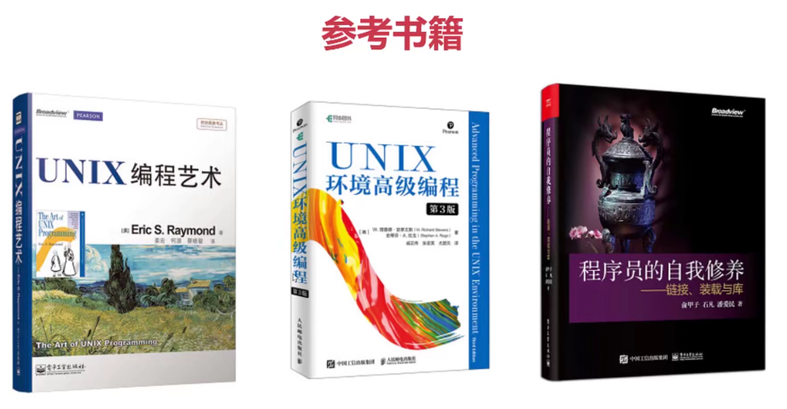

# 慕课网《[C 语言体系化精讲](https://coding.imooc.com/class/463.html) 》代码 + 笔记

1. **C语言必备基础**：编译环境搭建，IDE配置，调试方法，代码规范风格。
2. **C语言快速入门**：C语言的基本数据类型、变量常量、运算符、分支和循环语句。
3. **函数与程序结构**：函数的声明、实现以及使用方法，变量的类型和作用域。
4. **预处理和宏**：C语言的预处理和宏的使用方法，包括文件包含、条件编译、宏函数等特性的理解和应用。
5. **玩转数组**：数组在内存当中的存储形式，字符串的基本概念，数组作为函数参数传递。
6. **吃透指针**：指针的运算、函数参数传递以及返回值的内存复制过程、动态内存分配、函数指针。
7. **聚合数据类型**：结构体、联合体、枚举、内存对齐特性。
8. **字符串的应用**：标准库中对字符串提供的支持，包括窄字符与宽字符相关的字符类型判断，字符串比较、连接、复制，原始内存的清除、复制、移动等工具函数的应用，以及窄字符与宽字符的转换函数及编码设置的方法、C99新增的restrict、C11新增的安全版本函数。
9. **时间的应用**：标准库中对时间提供的支持，包括计算机软件当中各类常见的时间概念，获取系统时间、日历时间的方法，时间的格式化和解析的方法；编写跨平台的代码的思路。
10. **文件的输入输出**：文件输入输出的支持，包括文件流的概念，文件流按字符、按行、按字节读写函数的使用、文件流缓冲概念。
11. **线程与并发**：C11引入的线程以及并发相关知识。
12. **编译、链接和库**：C语言编译过程；发布C库，conan第三方依赖管理；其他语言调用C语言库。
13. **GUI 编程实践**：Linux桌面GUI主流技术GTK+，跨平台GUI应用程序开发。
14. **综合案例**：桌面跨平台高仿Mac版计算器
15. **综合案例**：桌面跨平台的下载工具。
16. **课程总结**

技术总结：

后续学习发展：

- 夯实数据结构、算法基础。
- 深入学习 Unix/Linux 系统编程。
- 研发开发框架源码，例如 Ngnix、MySQL 等。
- 学习 C++、Go 等更适合业务开发的语言。

推荐书籍：

