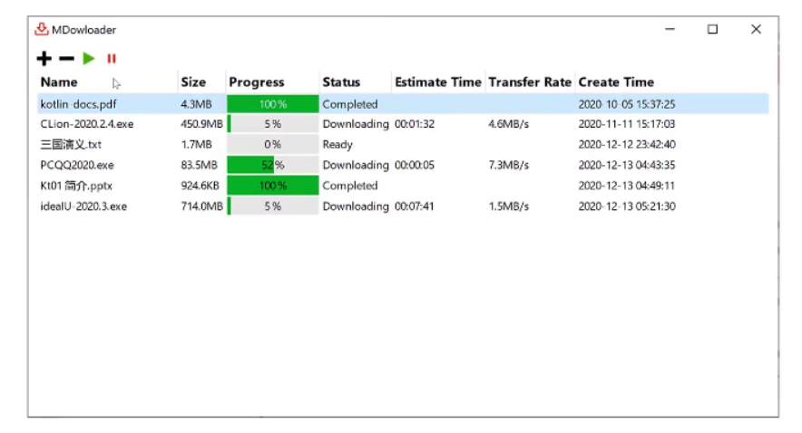
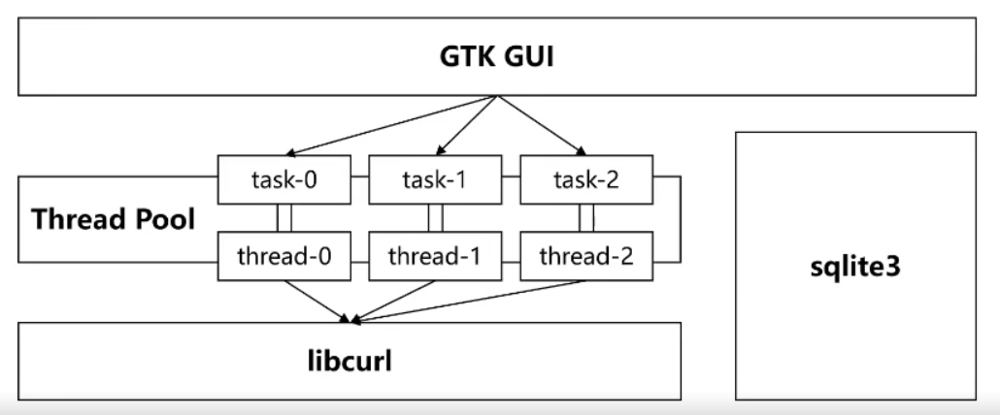
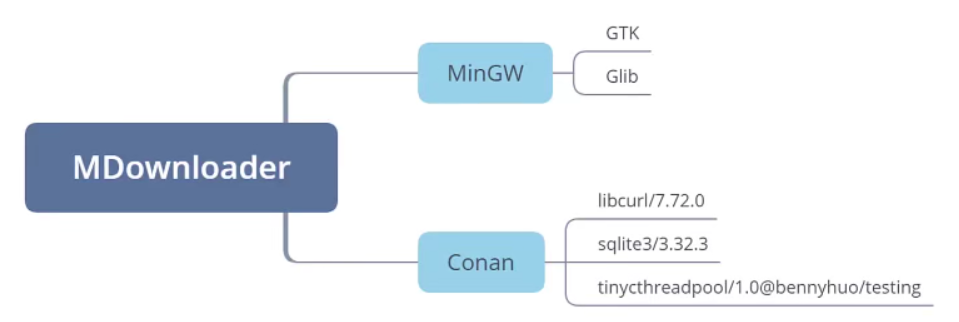

# 慕课网《[C 语言体系化精讲](https://coding.imooc.com/class/463.html) 》 第十六章-跨平台的下载工具

本章程序仅支持 Windows + Mingw 环境【因为如果使用 msvc 的话，就要自己编译 gtk】。

## 项目介绍

**下载器效果**：



**下载器接口设计**：



**下载器技术栈**：



## 遇到问题

使用 conan 下载 sqlite3 然后用 mingw 编译时，失败了，遇到如下问题：

```shell
sqlite3/3.32.3: ERROR: Package '5511a12d7f2fe4fae97b5d00f4d1a52147d3cdf5' build failed
sqlite3/3.32.3: WARN: Build folder D:\dev_data\.conan\data\sqlite3\3.32.3\_\_\build\5511a12d7f2fe4fae97b5d00f4d1a52147d3cdf5
ERROR: sqlite3/3.32.3: Error in build() method, line 117
        cmake = self._configure_cmake()
while calling '_configure_cmake', line 113
        self._cmake.configure()
        ConanException: Error 1 while executing cd D:\dev_data\.conan\data\sqlite3\3.32.3\_\_\build\5511a12d7f2fe4fae97b5d00f4d1a52147d3cdf5 && cmake -G "MinGW Makefiles" -DCMAKE_BUILD_TYPE="Release" -DCONAN_IN_LOCAL_CACHE="ON" -DCONAN_COMPILER="gcc" -DCONAN_COMPILER_VERSION="9.2" -DCONAN_CXX_FLAGS="-m64" -DCONAN_SHARED_LINKER_FLAGS="-m64" -DCONAN_C_FLAGS="-m64" -DBUILD_SHARED_LIBS="OFF" -DCMAKE_INSTALL_PREFIX="D:\dev_data\.conan\data\sqlite3\3.32.3\_\_\package\5511a12d7f2fe4fae97b5d00f4d1a52147d3cdf5" -DCMAKE_INSTALL_BINDIR="bin" -DCMAKE_INSTALL_SBINDIR="bin" -DCMAKE_INSTALL_LIBEXECDIR="bin" -DCMAKE_INSTALL_LIBDIR="lib" -DCMAKE_INSTALL_INCLUDEDIR="include" -DCMAKE_INSTALL_OLDINCLUDEDIR="include" -DCMAKE_INSTALL_DATAROOTDIR="share" -DCMAKE_EXPORT_NO_PACKAGE_REGISTRY="ON" -DCONAN_EXPORTED="1" -DSQLITE3_BUILD_EXECUTABLE="True" -DTHREADSAFE="1" -DENABLE_COLUMN_METADATA="True" -DENABLE_DBSTAT_VTAB="False" -DENABLE_EXPLAIN_COMMENTS="False" -DENABLE_FTS3="False" -DENABLE_FTS3_PARENTHESIS="False" -DENABLE_FTS4="False" -DENABLE_FTS5="False" -DENABLE_JSON1="False" -DENABLE_PREUPDATE_HOOK="False" -DENABLE_SOUNDEX="False" -DENABLE_RTREE="True" -DENABLE_UNLOCK_NOTIFY="True" -DENABLE_DEFAULT_SECURE_DELETE="False" -DUSE_ALLOCA="False" -DOMIT_LOAD_EXTENSION="False" -DHAVE_FDATASYNC="True" -DHAVE_GMTIME_R="True" -DHAVE_LOCALTIME_R="False" -DHAVE_POSIX_FALLOCATE="False" -DHAVE_STRERROR_R="True" -DHAVE_USLEEP="True" -DDISABLE_GETHOSTUUID="False" -DMAX_BLOB_SIZE="1000000000" -Wno-dev D:\dev_data\.conan\data\sqlite3\3.32.3\_\_\build\5511a12d7f2fe4fae97b5d00f4d1a52147d3cdf5
```
