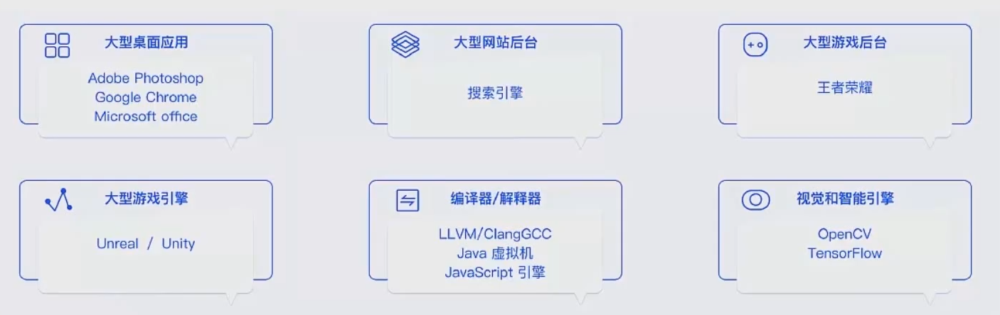
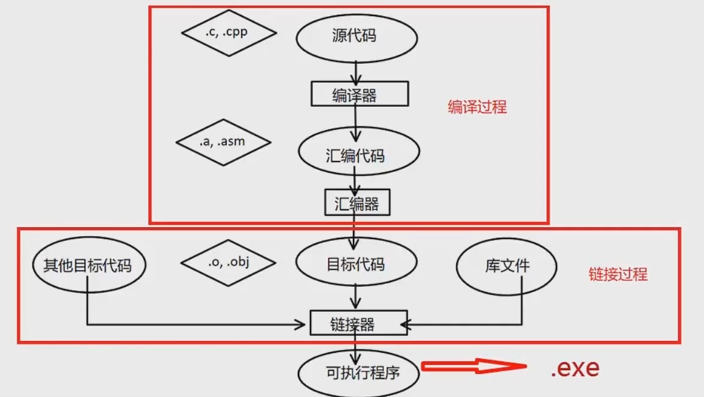
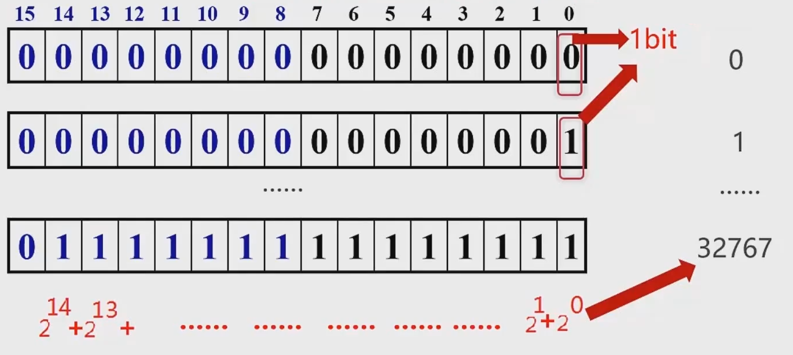

# 慕课网：[《重学 C++》](https://coding.imooc.com/class/414.html)

## 1 C++ 概括

### 课程解介绍

`C++` 应用场景：

`C++` 理论体系：

**学习目标**：

1. `C++` 基础：
   1. 深入底层，窥探本质，来深入讲解 `C++` 基础。
   2. 结合讲解知名企业的常见面试题来巩固对 `C++` 语言的运用和理解，同时提升大家的职场竞争力。
   3. 从编程思想的演变讲起到实际项目中的异常，面向对象等的实践运用经验，应当规避的坑。
2. 高阶语法和编程思想 A 实践：
   1. `C++` 的指针和内存分配的见解，大厂的实践经验。
   2. `C++` 最新标准的发展趋势，及`C++` 语言的未来趋势预测。
3. 手把手带你项目实战-“慕影”播放器：
   1. 了解企业级的桌面软件开发架构思想如 MVC 等。
   2. 学习 `C++` 开源库的使用经验。
   3. 巩固 `C++` 语法基础知识的同时了解企业实战中使用的方式和规范。
   4. 增加调试软件，提升软件性能经验，如追踪内存泄漏、使用双缓存等。
   5. 学习音视频解码的基础知识。

### C++ 历史

- `C++` 编程语言的历史可追溯到 1979， Bjarne Stroustrup 创立了带类的 C。顾名思义，这是 C 语言的超集； 1983，语言的名字真正变成了 `C++`。
- `C++` 在最开始可以称作 C 语言的增强版，但在后来， `C++` 又引入了很多新的功能，逐步增强了`C++` 的可用性， 1998 年伴随着 STL 标准库的诞生，一堆新的功能和特性的产生， `C++` 标准委员会发布了第一个国际标准 `C++ + ISO/EC 1488`：称为 `C++98`；
- 在 2011 年中期， `C++` 标准(称为 `C++11`)完成了新的标准。Boost 库项目对新标准产生了相当大的影响，一些新模块直接从相应的 Boost 库中派生出来。
- `C++11` 之后， `C++` 以每三年一版的频度发布着新的语言标准，每一版都在基本保留向后兼容性的同时，提供着改进和新功能。

### C++ 特点

优点：

1. 强大的抽封装能力：这让 `C++` 语言具备了强大的开发工程能力时，在提供封装能力的同时最大程度的保留了高性能。
2. 高性能：运行快，快并且占用资源少一直是 `C++`语言的追求。
3. 低功耗：特别适合在各种微型的嵌入式设备中运行高效的程序。

缺点：

1. 语法相对复杂，细节比较多，习曲线比较陡峭。
2. 需要一些好的规范和范，否则代码很难维护。

## 2 C++基础语法

### 编程语言的层次和类型

1. 机器语言
2. 编译型语言。
3. 解释型语言。
4. 脚本语言。

`C++` 是编译型语言，编译的过程大概如下：

### 数据类型

整型的表达方式：

## 3 C++的运算符与表达式

1. 3-1 运算符表达式和基本语句
2. 3-2 运算符表达式和基本语句--算术运算符
3. 3-3 运算符表达式和基本语句--关系运算符
4. 3-4 运算符表达式和基本语句--逻辑运算符
5. 3-5 运算符表达式和基本语句--赋值运算符
6. 3-6 运算符表达式和基本语句--位运算符
7. 3-7 运算符表达式和基本语句--杂项运算符及运算符的优先级
8. 3-8 语言的注释
9. 3-9 第三章课后练习
10. 3-10 提升补充部分：补码 1
11. 3-11 提升补充部分：补码 2
12. 3-12 提升补充部分：补码及位运算说明

## 第 4 章 C++基础容器

1.  4-1 序列容器--数组
2.  4-2 off-by-one error 数组下标
3.  4-3 数组增删改查及二维数组
4.  4-4 动态数组 Vector1
5.  4-5 动态数组 vector2
6.  4-6 字符串简介
7.  4-7 Unicode 编码
8.  4-8 字符串的指针表示
9.  4-9 字符串基本操作 1
10. 4-10 字符串基本操作 2
11. 4-11 string 的简介

## 第 5 章 彻底学会 C++ 指针，引用

1.  5-1 指针的概念
2.  5-2 左值与右值
3.  5-3 一般指针，数组指针和指针数组
4.  5-4 const 与指针
5.  5-5 指向指针的指针
6.  5-6 关于野指针
7.  5-7 指针的基本操作一
8.  5-8 指针的基本操作二
9.  5-9 指针的基本操作三
10. 5-10 CPP 程序的存储区域划分
11. 5-11 CPP 程序的存储区域划分总结
12. 5-12 CPP 动态分配和回收原则
13. 5-13 RAII 初步
14. 5-14 几种变量的对比
15. 5-15 内存泄漏
16. 5-16 智能指针 auto_ptr
17. 5-17 智能指针 unique_ptr
18. 5-18 shared_ptr 和 weak_ptr 理论讲解
19. 5-19 shared_ptr 和 weak_ptr 代码演示
20. 5-20 引用

## 第 6 章 C++基础句法

1.  6-1 图灵机与三种基本结构
2.  6-2 if 语句基础
3.  6-3 if 语句的例子
4.  6-4 switch 分支基础
5.  6-5 switch 和 if 的对比
6.  6-6 自定义类型--枚举
7.  6-7 自定义类型--结构体与联合体
8.  6-8 结构体的内存布局
9.  6-9 三种循环的基本使用与比较
10. 6-10 for 循环的一个优化实例
11. 6-11 函数基础
12. 6-12 函数重载 overload 与 Name Mangling
13. 6-13 指向函数的指针与返回指针的函数
14. 6-14 命名空间。
15. 6-15 函数体的 Hack 过程
16. 6-16 内联函数。
17. 6-17 数学归纳法与递归
18. 6-18 递归的特点和 Hack 过程
19. 6-19 尾递归的优化
20. 6-20 递归的动态规划思路

## 第 7 章 C++高级语法

1.  7-1 从抽象到面向对象编程
2.  7-2 面向对象的抽象法则 1-具体类型的抽象
3.  7-3 对象的属性
4.  7-4 运算符重载
5.  7-5 拷贝构造及临时对象的优化
6.  7-6 前置与后置操作符
7.  7-7 标准输入输出 IO 重载
8.  7-8 IO 流基础
9.  7-9 IO 缓存区
10. 7-10 文件操作基础
11. 7-11 文本文件的操作
12. 7-12 二进制文件的操作
13. 7-13 Complex 其他运算符重载
14. 7-14 头文件重复包含问题
15. 7-15 关于前七章的练习题及答案
16. 7-16 深拷贝浅拷贝及 move 语义的优化
17. 7-17 面向对象的抽象法则 2
18. 7-18 Hack 对象模型和虚函数
19. 7-19 面向对象三大特性及总结

## 第 8 章 C++编程思想

1.  8-1 软件的设计模式
2.  8-2 单例模式
3.  8-3 static 和单例模式的实现
4.  8-4 观察者模式
5.  8-5 list 的使用和观察者模式的实现 1
6.  8-6 观察者模式的实现 2
7.  8-7 void 星 NULL 和 nullptr
8.  8-8 static_cast 的使用
9.  8-9 reinterpret_cast 的使用
10. 8-10 static_cast 和 dynamic_cast 的使用
11. 8-11 Adapter 模式和多重继承
12. 8-12 Adapter 组合方式实现
13. 8-13 设计模式总结
14. 8-14 泛型编程之泛型函数 1
15. 8-15 泛型编程之泛型函数 2
16. 8-16 泛型编程的递推过程及总结

## 第 9 章 C++进阶编程

1.  9-1 STL 标准库简介
2.  9-2 序列型容器和函数对象基本使用
3.  9-3 关联容器 map 的基本使用和查找
4.  9-4 关联容器的插入删除及迭代器失效问题
5.  9-5 从函数指针到仿函数模板
6.  9-6 算法 transform 和 lambda 表达式
7.  9-7 STL 容器的统计与二分查找
8.  9-8 从手写全排列到 STL 的实现
9.  9-9 迭代器基本使用
10. 9-10 手写 GC 与异常
11. 9-11 自定义迭代器与手写 GC
12. 9-12 容器适配器
13. 9-13 空间配置器初步
14. 9-14 自定义空间配置器
15. 9-15 STL 空间配置器源码剖析与 STL 总结
16. 9-16 关于 Boost 库
17. 9-17 CPP 多线程基础
18. 9-18 多线程银行存取款案例
19. 9-19 多线程小结

## 第 11 章到第 14 章：实现项目《慕影》

略

## 第 15 章 C++的陷阱和经验

1.  15-1 谈谈个人的学习工作经历
2.  15-2 谈谈个人学习工作的一点感悟
3.  15-3 推荐几本 CPP 的书籍
4.  15-4 谈谈 CPP 的陷阱
